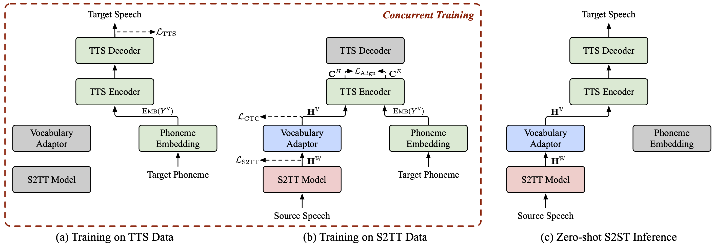

# ComSpeech

<!-- [](https://arxiv.org/abs/2406.03049) -->
[](https://ictnlp.github.io/ComSpeech-Site/)


> **Authors: [Qingkai Fang](https://fangqingkai.github.io/), [Shaolei Zhang](https://zhangshaolei1998.github.io/), [Zhengrui Ma](https://scholar.google.com.hk/citations?user=dUgq6tEAAAAJ), [Min Zhang](https://scholar.google.com.hk/citations?user=CncXH-YAAAAJ), [Yang Feng*](https://people.ucas.edu.cn/~yangfeng?language=en)**

Code for ACL 2024 paper "[Can We Achieve High-quality Direct Speech-to-Speech Translation without Parallel Speech Data?](https://arxiv.org)".



<p align="center">
  🎧 Listen to <a href="https://ictnlp.github.io/ComSpeech-Site/">ComSpeech's translated speech</a> 🎧 
</p>

## 💡 Highlights

1. ComSpeech is a general composite S2ST model architecture, which can **seamlessly integrate any pretrained S2TT and TTS models into a direct S2ST model**.
2. ComSpeech surpasses previous two-pass models like UnitY and Translatotron 2 **in both translation quality and decoding speed**.
3. With our proposed training strategy **ComSpeech-ZS**, we **achieve performance comparable to supervised training without using any parallel speech data**.

## 🔥 Quick Start

### Requirements

- python==3.8, torch==2.1.2
- Install fairseq:

  ```bash
  cd fairseq
  pip install -e .
  ```

### Data Preparation

> [!Note] 
> This section is under construction and will be updated within 3 days.

### ComSpeech (Supervised Learning)

> [!Note] 
> The following scripts use 4 RTX 3090 GPUs by default. You can adjust `--update-freq`, `--max-tokens-st`, `--max-tokens`, and `--batch-size-tts` depending on your available GPUs.

In the **supervised learning** scenario, we first use the S2TT data and TTS data to pretrain the S2TT and TTS models respectively, and then finetune the entire model using the S2ST data. The following script is an example on the CVSS Fr-En dataset. For De-En and Es-En directions, you only need to change the source language in scripts.

1. Pretrain the S2TT model, and the best checkpoint will be saved at `ComSpeech/checkpoints/st.cvss.fr-en/checkpoint_best.pt`.

```bash
bash ComSpeech/train_scripts/st/train.st.cvss.fr-en.sh
```

2. Pretrain the TTS model, and the best checkpoint will be saved at `ComSpeech/checkpoints/tts.fastspeech2.cvss-fr-en/checkpoint_best.pt`.

```bash
bash ComSpeech/train_scripts/tts/train.tts.fastspeech2.cvss-fr-en.sh
```

3. Finetune the entire model using the S2ST data, and the chekpoints will be saved at `ComSpeech/checkpoints/s2st.fr-en.comspeech`.

```
bash ComSpeech/train_scripts/s2st/train.s2st.fr-en.comspeech.sh
```

4.  Average the 5 best checkpoints and test the results on the `test` set.

```
bash ComSpeech/test_scripts/generate.fr-en.comspeech.sh
```

> [!Note] 
> To run inference, you need to download the pretrained VCTK_V1 vocoder from [this link](https://drive.google.com/drive/folders/1vJlfkwR7Uyheq2U5HrPnfTm-tzwuNuey) and place it in the `hifi-gan/` directory. 

### ComSpeech-ZS (Zero-shot Learning)

In the **zero-shot learning** scenario, we first pretrain the S2TT model using CVSS Fr/De/Es-En S2TT data, and pretrain the TTS model using CVSS X-En TTS (X∉{Fr,De,Es}) data. Then, we finetune the entire model in two stages using these two parts of the data.

1. Pretrain the S2TT model, and the best checkpoint will be saved at `ComSpeech/checkpoints/st.cvss.fr-en/checkpoint_best.pt`.

```bash
bash ComSpeech/train_scripts/st/train.st.cvss.fr-en.sh
```

2. Pretrain the TTS model, and the best checkpoint will be saved at `ComSpeech/checkpoints/tts.fastspeech2.cvss-x-en/checkpoint_best.pt` (note: this checkpoint is used for experiments on all language pairs in the zero-shot learning scenario).

```bash
bash ComSpeech/train_scripts/tts/train.tts.fastspeech2.cvss-x-en.sh
```

3. Finetune the S2TT model and the vocabulary adaptor using S2TT data (stage 1), and the best checkpoint will be saved at `ComSpeech/checkpoints/st.cvss.fr-en.ctc/checkpoint_best.pt`.

```
bash ComSpeech/train_scripts/st/train.st.cvss.fr-en.ctc.sh
```

4. Finetune the entire model using both S2TT and TTS data (stage 2), and the checkpoints will be saved at `ComSpeech/checkpoints/s2st.fr-en.comspeech-zs`.

```
bash ComSpeech/train_scripts/s2st/train.s2st.fr-en.comspeech-zs.sh
```

5. Average the 5 best checkpoints and test the results on the `test` set.

```
bash ComSpeech/test_scripts/generate.fr-en.comspeech-zs.sh
```

### Checkpoints

We have released the checkpoints for each of the above steps. You can download them from 🤗[HuggingFace](https://huggingface.co/ICTNLP/ComSpeech_Models).

#### Supervised Learning

| Directions | S2TT Pretrain                                                | TTS Pretrain                                                 | ComSpeech                                                    |
| ---------- | ------------------------------------------------------------ | ------------------------------------------------------------ | ------------------------------------------------------------ |
| Fr-En      | [[download](https://huggingface.co/ICTNLP/ComSpeech_Models/resolve/main/checkpoints/st.cvss.fr-en/checkpoint_best.pt?download=true)] | [[download](https://huggingface.co/ICTNLP/ComSpeech_Models/resolve/main/checkpoints/tts.fastspeech2.cvss-fr-en/checkpoint_best.pt?download=true)] | [[download](https://huggingface.co/ICTNLP/ComSpeech_Models/resolve/main/checkpoints/s2st.fr-en.comspeech/average_best_checkpoint.pt?download=true)] |
| De-En      | [[download](https://huggingface.co/ICTNLP/ComSpeech_Models/resolve/main/checkpoints/st.cvss.de-en/checkpoint_best.pt?download=true)] | [[download](https://huggingface.co/ICTNLP/ComSpeech_Models/resolve/main/checkpoints/tts.fastspeech2.cvss-de-en/checkpoint_best.pt?download=true)] | [[download](https://huggingface.co/ICTNLP/ComSpeech_Models/resolve/main/checkpoints/s2st.de-en.comspeech/average_best_checkpoint.pt?download=true)] |
| Es-En      | [[download](https://huggingface.co/ICTNLP/ComSpeech_Models/resolve/main/checkpoints/st.cvss.es-en/checkpoint_best.pt?download=true)] | [[download](https://huggingface.co/ICTNLP/ComSpeech_Models/resolve/main/checkpoints/tts.fastspeech2.cvss-es-en/checkpoint_best.pt?download=true)] | [[download](https://huggingface.co/ICTNLP/ComSpeech_Models/resolve/main/checkpoints/s2st.es-en.comspeech/average_best_checkpoint.pt?download=true)] |

#### Zero-shot Learning

| Directions | S2TT Pretrain                                                | TTS Pretrain                                                 | 1-stage Finetune                                             | 2-stage Finetune                                             |
| ---------- | ------------------------------------------------------------ | ------------------------------------------------------------ | ------------------------------------------------------------ | ------------------------------------------------------------ |
| Fr-En      | [[download](https://huggingface.co/ICTNLP/ComSpeech_Models/resolve/main/checkpoints/st.cvss.fr-en/checkpoint_best.pt?download=true)] | [[download](https://huggingface.co/ICTNLP/ComSpeech_Models/resolve/main/checkpoints/tts.fastspeech2.cvss-x-en/checkpoint_best.pt?download=true)] | [[download](https://huggingface.co/ICTNLP/ComSpeech_Models/resolve/main/checkpoints/st.cvss.fr-en.ctc/checkpoint_best.pt?download=true)] | [[download](https://huggingface.co/ICTNLP/ComSpeech_Models/resolve/main/checkpoints/s2st.fr-en.comspeech-zs/average_best_checkpoint.pt?download=true)] |
| De-En      | [[download](https://huggingface.co/ICTNLP/ComSpeech_Models/resolve/main/checkpoints/st.cvss.de-en/checkpoint_best.pt?download=true)] | [[download](https://huggingface.co/ICTNLP/ComSpeech_Models/resolve/main/checkpoints/tts.fastspeech2.cvss-x-en/checkpoint_best.pt?download=true)] | [[download](https://huggingface.co/ICTNLP/ComSpeech_Models/resolve/main/checkpoints/st.cvss.de-en.ctc/checkpoint_best.pt?download=true)] | [[download](https://huggingface.co/ICTNLP/ComSpeech_Models/resolve/main/checkpoints/s2st.de-en.comspeech-zs/average_best_checkpoint.pt?download=true)] |
| Es-En      | [[download](https://huggingface.co/ICTNLP/ComSpeech_Models/resolve/main/checkpoints/st.cvss.es-en/checkpoint_best.pt?download=true)] | [[download](https://huggingface.co/ICTNLP/ComSpeech_Models/resolve/main/checkpoints/tts.fastspeech2.cvss-x-en/checkpoint_best.pt?download=true)] | [[download](https://huggingface.co/ICTNLP/ComSpeech_Models/resolve/main/checkpoints/st.cvss.es-en.ctc/checkpoint_best.pt?download=true)] | [[download](https://huggingface.co/ICTNLP/ComSpeech_Models/resolve/main/checkpoints/s2st.es-en.comspeech-zs/average_best_checkpoint.pt?download=true)] |

## 🖋 Citation

If you have any questions, please feel free to submit an issue or contact `fangqingkai21b@ict.ac.cn`.

If our work is useful for you, please cite as:

```
@inproceedings{fang-etal-2024-can,
    title = {Can We Achieve High-quality Direct Speech-to-Speech Translation without Parallel Speech Data?},
    author = {Fang, Qingkai and Zhang, Shaolei and Ma, Zhengrui and Zhang, Min and Feng, Yang},
    booktitle = {Proceedings of the 62nd Annual Meeting of the Association for Computational Linguistics},
    year = {2024},
}
```